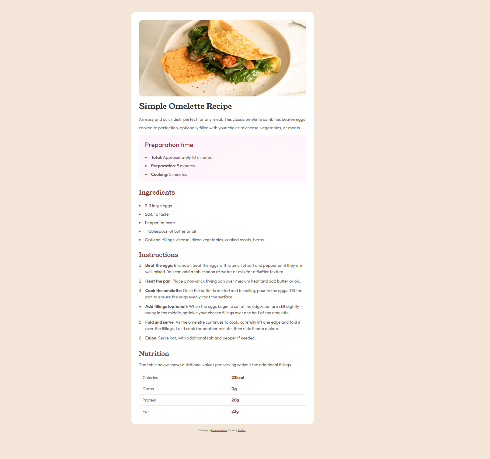
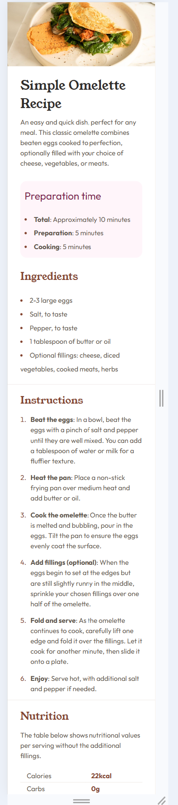

# Frontend Mentor - Recipe page solution

This is a solution to the [Recipe page challenge on Frontend Mentor](https://www.frontendmentor.io/challenges/recipe-page-KiTsR8QQKm). Frontend Mentor challenges help you improve your coding skills by building realistic projects. 

### Screenshot

### Links

- Solution URL: [Add solution URL here](https://github.com/spun21m/Recipe-Page)
- Live Site URL: [Add live site URL here](https://spun21m.github.io/Recipe-Page/)

### Built with

- Semantic HTML5 markup
- CSS custom properties
- Mobile-first workflow

## Author

Sital Pun
